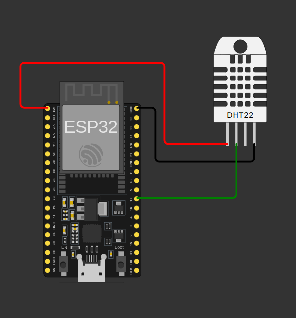

# DataLogger de Humedad y Temperatura en GoogleSheet

Este código pertenece a la Erronka 0 del Grado de Especialización en Fabricación Inteligente.

<a href= "https://www.lasalleberrozpe.eus/web/es/grado_especializacion_fabricacion_inteligente">

En la carpeta src podemos encontrar el código Arduino para un ESP32 para el control de un sensor de temperatura y Humedad DHT11. 

El esquema que hay que montar es el de la siguiente imagen:

